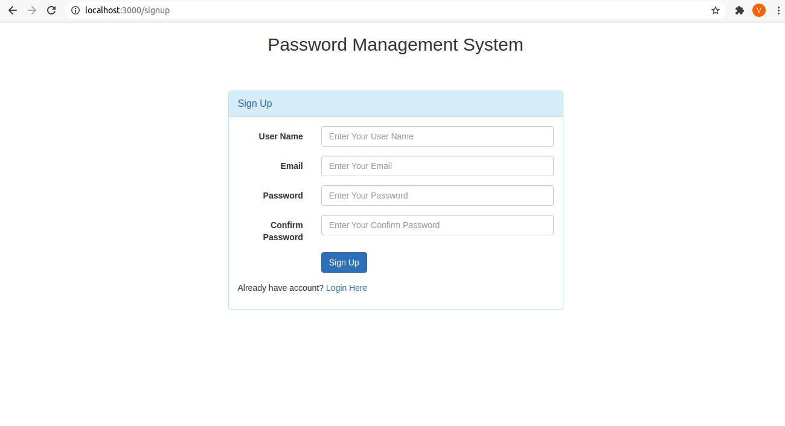
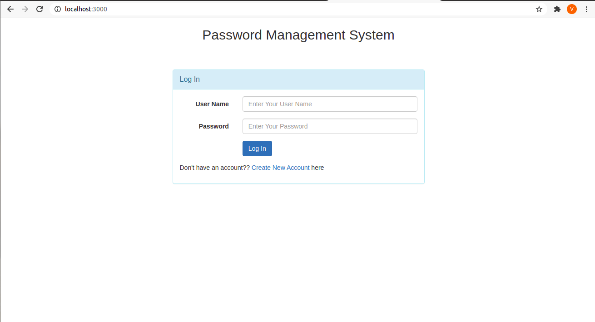
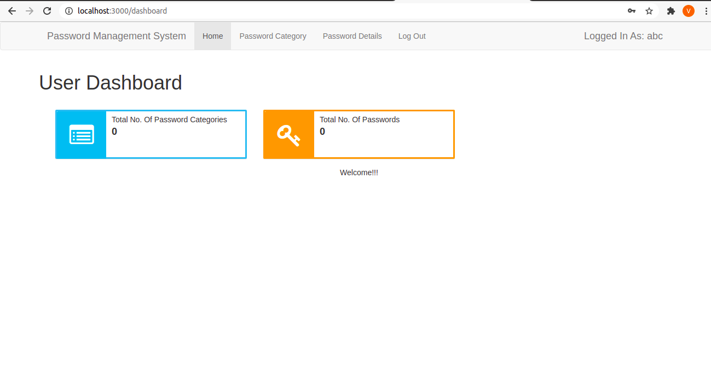
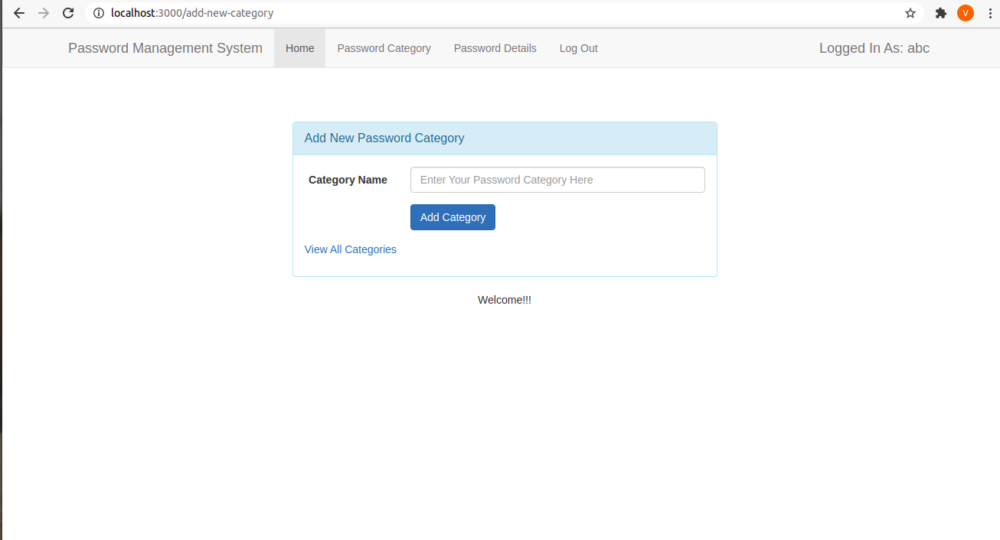
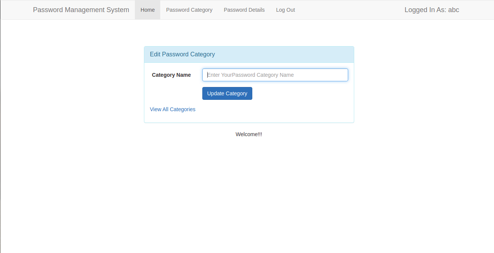
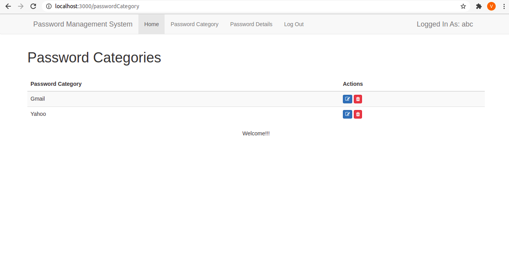
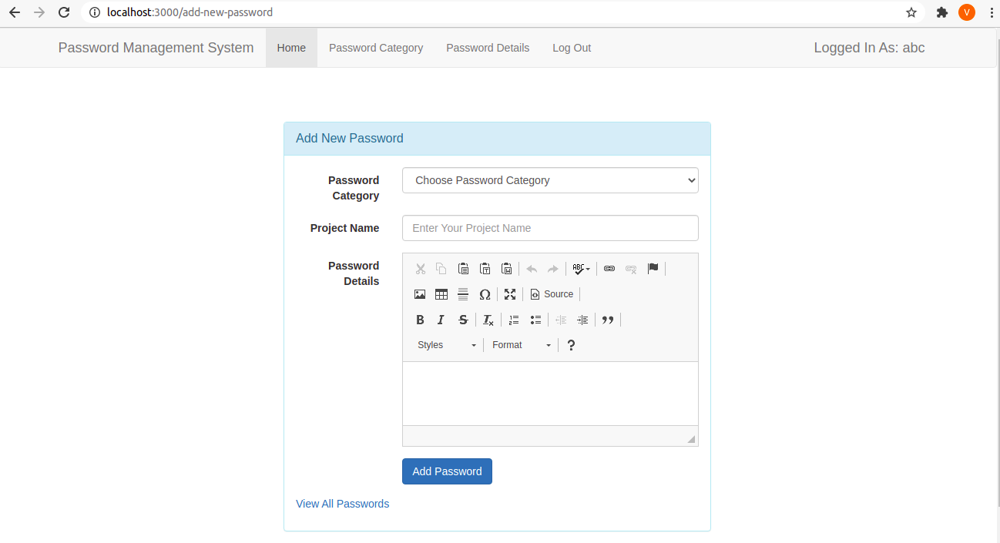
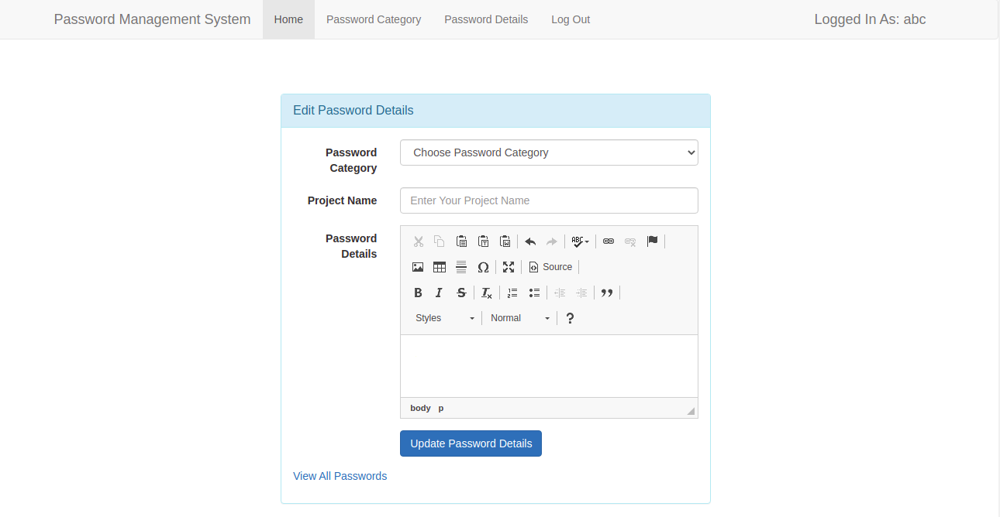
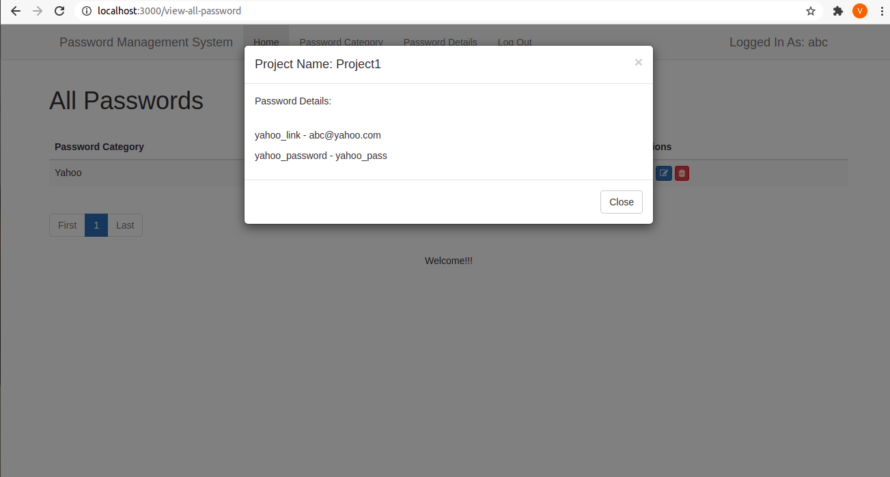
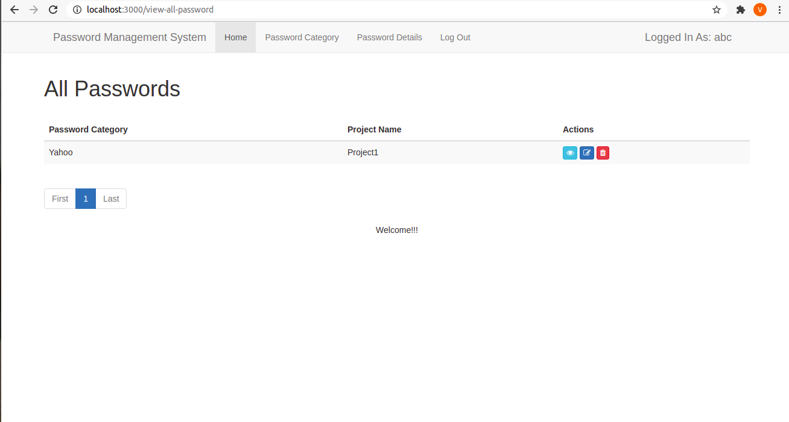

# Password Management System

Password Management System Project manages login details i.e username, password, etc. of various categories at one place is very necessary in today's scenario of rush and hush. 
To manage our passwords, we need to create an account i.e Sign up and then login using LogIn page.

This project allows us to:

-- Manages all kinds of passwords and keeps count of no. of user passwords and their categories with the help of dashboard.

-- Add different categories of passwords like Gmail, Yahoo, Amazon, etc.

-- Manage the categories i.e edit or delete.

-- View lists of categories.

-- Add new passwords using a form containing entries for project name, password details like username and password for the corresponding chosen category from drop-down menu.

-- Manage passwords like edit or delete.

-- View password details by a pop-up.

--View lists of Passwords.

## Tools Used:

Node js, Express js and Mongoose.
